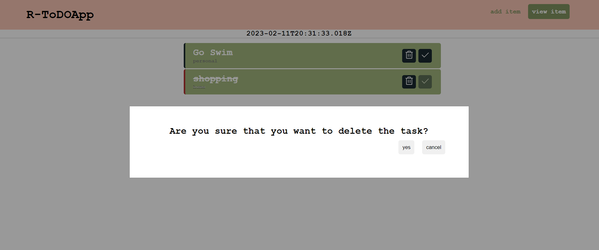

# Online Library

A simple and user-friendly to-do list application built using React. This app allows you to add and remove tasks, mark them as complete or incomplete, and keep track of your daily tasks.

## Features
- Add new tasks to the list

- Mark tasks as complete

- Remove tasks from the list

## Technologies used
- React
- JavaScript
- CSS
- HTML

## Installation and Setup Instructions

To clone down this repository. You will need node and npm installed globally on your machine.

**Installation:**

npm install

**To Run Test Suite:**

npm test

**To Start Server:**

npm start

**To Visit App:**

http://localhost:3000/view
